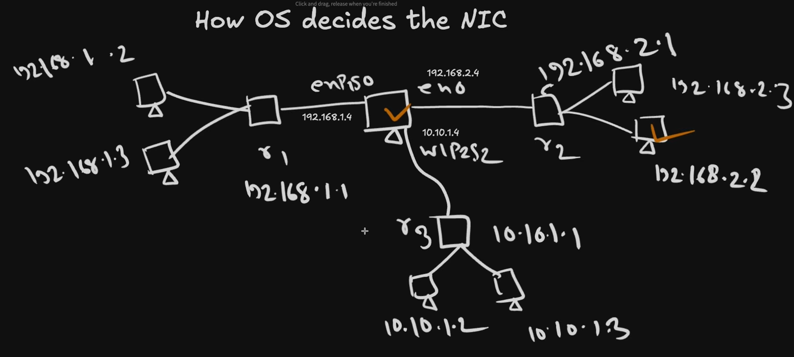

# Multiple NICs – Complete Guide (Why, How, When)

**Based on Go With Habib Docker Series – Classes 047 to 050**

This document explains **everything** about Multiple Network Interface Cards (NICs) in one place, step by step, so you can understand every detail even after months.

---

## 1. What is a NIC?

**NIC = Network Interface Card**

It is the hardware (or virtual hardware) that allows a computer to send and receive data on a network.

### What a NIC does:
1. Receives binary data (0s and 1s) from the Operating System
2. Converts it into electrical signals (Ethernet) or electromagnetic signals (Wi-Fi)
3. Sends the signal out
4. Receives incoming signals and converts them back to binary for the OS

Until Class 046, we always assumed **one computer = one NIC**.

---

## 2. Why Can a Computer Have Multiple NICs?

In real life, a computer can have many NICs at the same time:

| Type of NIC              | Example                     | How it connects |
|--------------------------|-----------------------------|-----------------|
| Built-in Ethernet        | en0 / eth0                  | Cable           |
| Built-in Wi-Fi           | wlan0                       | Wireless        |
| USB Wi-Fi Adapter        | wlp2s0                      | USB             |
| Additional PCI Ethernet  | enp1s0                      | PCI slot        |
| Virtual NICs             | docker0, veth*, br-*        | Created by software |

### Why is this possible?
Because of the **PCI (Peripheral Component Interconnect)** system on the motherboard.

- **Peripheral** = Path / Road
- **Component** = Devices (CPU, RAM, Graphics Card, NICs, USB devices…)
- **Interconnect** = Connection between all components

The motherboard has multiple **PCI buses** and **slots**. You can plug many network cards into these slots. That is why one computer can have multiple NICs.

---

## 3. Visual Topology – Multiple NICs in Action



### Explanation of the Diagram:

The central computer has **three NICs**:

| NIC Name     | IP Address of Computer | Connected To     | Network          |
|--------------|------------------------|------------------|------------------|
| **enp1s0**   | 192.168.1.4            | Router r1        | 192.168.1.0/24   |
| **en0**      | 192.168.2.4            | Router r2        | 192.168.2.0/24   |
| **wlp2s2**   | 10.10.1.4              | Router r3        | 10.10.1.0/24     |

- Left side (r1 network): Devices with IPs 192.168.1.2 and 192.168.1.3
- Right side (r2 network): Devices with IPs 192.168.2.1, 192.168.2.2, 192.168.2.3
- Bottom (r3 network): Devices with IPs 10.10.1.2 and 10.10.1.3

**Key Point:**  
One single computer is now part of **three different networks** at the same time and has **three different IP addresses**.

---

## 4. How Does Each NIC Get Its Own IP?

Each NIC independently performs the **DHCP DORA process**:

1. **Discover** – Broadcast to find DHCP server
2. **Offer** – Server offers an IP
3. **Request** – Client requests that IP
4. **Acknowledge** – Server confirms

So:
- enp1s0 gets IP from Router r1 → `192.168.1.4`
- en0 gets IP from Router r2 → `192.168.2.4`
- wlp2s2 gets IP from Router r3 → `10.10.1.4`

---

## 5. The Big Problem

When the computer wants to **send** data, a serious question appears:

> “I have three NICs and three IP addresses.  
> Which NIC should I use?  
> Which Source IP should I put in the packet?”

If the OS chooses the wrong NIC, the packet will go to the wrong network and never reach the destination.

---

## 6. The Solution – Routing Table

The Operating System maintains a **Routing Table**.

### How routes are added:

When a NIC receives an IP + Subnet Mask via DHCP, the OS calculates:

```
Network Address = IP Address  AND  Subnet Mask
```

Then it adds a route:

```
Destination Network  →  This NIC
```

It also adds a **Default Route** (`0.0.0.0/0`) pointing to the primary NIC’s gateway.

### Example Routing Table for our computer:

```
Destination          Gateway         Interface
------------------------------------------------
192.168.1.0/24       *               enp1s0
192.168.2.0/24       *               en0
10.10.1.0/24         *               wlp2s2
0.0.0.0/0            192.168.2.1     en0          ← Default
```

---

## 7. How the OS Decides the NIC (Step-by-Step)

This is the most important part.

### Algorithm:

1. Take the **Destination IP** of the packet.
2. Perform **bitwise AND** with the Subnet Mask of **every** NIC.
3. See which resulting Network Address matches an entry in the Routing Table.
4. Choose the route that has the **Longest Prefix Match** (most matching bits).
5. If two routes match with the same length → prefer the **non-default** route.
6. If nothing matches → use the **Default Route**.

---

## 8. Real Example (From the Second Diagram)

The computer wants to send a request to:

```
http://192.168.2.2:3000/hello
```

### Layer-by-Layer Construction:

**Application Layer:**
```
GET /hello
```

**Transport Layer:**
```
Source Port: 50154 (ephemeral)
Destination Port: 3000
```

**Network Layer (the critical decision):**

Destination IP = `192.168.2.2`

OS performs:

```
192.168.2.2  AND  255.255.255.0  =  192.168.2.0
```

This matches the route `192.168.2.0/24` which is mapped to interface **en0**.

Therefore:
- Selected NIC = **en0**
- Source IP = IP of en0 = **192.168.2.4**

**Final Network Layer header:**
```
Source IP: 192.168.2.4
Destination IP: 192.168.2.2
```

**Data Link Layer:**
- Source MAC = MAC address of en0
- Destination MAC = MAC of 192.168.2.2 (resolved via ARP)

**Physical Layer:**
- Binary data is converted to signal and sent out through **en0**

---

## 9. Why Longest Prefix Match is Used

Suppose the Destination IP matches two routes:

- One route with /24 (24 bits match)
- Default route /0 (0 bits match)

The OS always prefers the **more specific** route (/24).

This is called **Longest Prefix Match**.

---

## 10. Complete Flow Summary

```
1. Application wants to talk to a Destination IP
2. Transport Layer adds ports
3. Network Layer asks: “Which NIC should I use?”
4. OS looks at Routing Table + performs Longest Prefix Match
5. Correct NIC and Source IP are selected
6. Data Link Layer adds MAC addresses (using ARP if needed)
7. Physical Layer sends the signal through the chosen NIC
```

---

## 11. Key Takeaways (Remember These)

| Concept                        | Meaning |
|--------------------------------|--------|
| Multiple NICs                  | One computer can belong to many networks |
| Each NIC gets its own IP       | Via independent DHCP |
| Routing Table                  | Tells the OS which NIC to use for which destination |
| Longest Prefix Match           | Algorithm used to choose the best route |
| Default Route                  | Used only when no better match exists |
| Source IP                      | Always becomes the IP of the selected NIC |
| Source MAC                     | Always becomes the MAC of the selected NIC |

---

## 12. Why This is Extremely Important for Docker

Docker creates many **virtual NICs**:
- `docker0` (default bridge)
- `veth*` pairs
- Custom bridges
- macvlan / ipvlan interfaces

Containers also become multi-homed in advanced setups.  
Everything you learned here is the **exact foundation** of Docker networking.

---

**End of Complete Guide**

This document combines Classes 047, 048, 049 and 050 into one clear, step-by-step explanation.  
You now understand **Why**, **How** and **When** the Operating System chooses a particular NIC.
