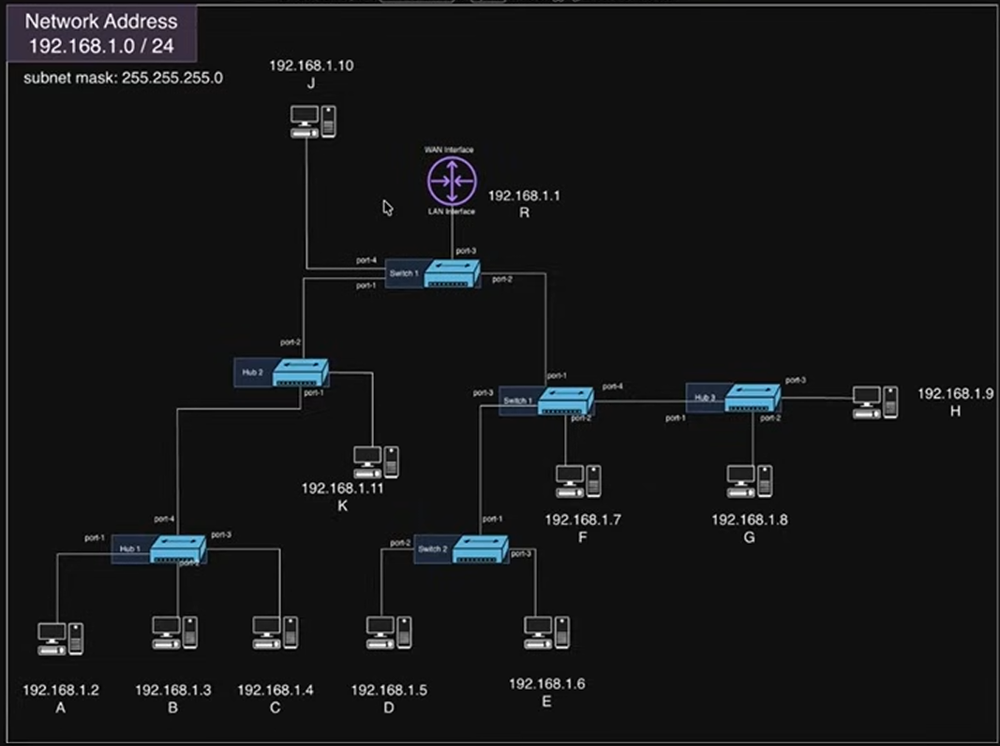

# Networking Inside A Network

This class explains **how computers communicate with each other inside the same network (LAN)**.  
It introduces **ARP (Address Resolution Protocol)** and shows the complete journey of a packet through Hubs and Switches in a complex network topology.

This document is written so that you can come back after 3–4 months and still clearly remember every step.

---

## Network Topology Used in This Class



**Network Address:** `192.168.1.0/24`  
**Subnet Mask:** `255.255.255.0`

### Devices in the Diagram

| Label | Device Type     | IP Address         | Connected To          |
|-------|-----------------|--------------------|-----------------------|
| **R** | Home Router     | LAN: `192.168.1.1` | Internal Switch       |
| **J** | Computer        | `192.168.1.10`     | Switch 1 (port-4)     |
| **K** | Computer        | `192.168.1.11`     | Hub 2                 |
| **A** | Computer        | `192.168.1.2`      | Hub 1                 |
| **B** | Computer        | `192.168.1.3`      | Hub 1                 |
| **C** | Computer        | `192.168.1.4`      | Hub 1                 |
| **D** | Computer        | `192.168.1.5`      | Switch 2              |
| **E** | Computer        | `192.168.1.6`      | Switch 2              |
| **F** | Computer        | `192.168.1.7`      | Switch 1              |
| **G** | Computer        | `192.168.1.8`      | Hub 3                 |
| **H** | Computer        | `192.168.1.9`      | Hub 3                 |

**Interconnecting Devices:**
- **Hub 1, Hub 2, Hub 3** → Layer 1 (blind flooding)
- **Switch 1, Switch 2** → Layer 2 (use CAM table)
- Router’s internal switch (ports 1–4)

All devices are in the **same subnet**, so they form one big Local Area Network.

---

## Scenario

Computer **A** (`192.168.1.2`) wants to send data to Computer **D** (`192.168.1.5`).

Example used in class:  
A friend is running a Go HTTP server on port `3000`.  
Another computer hits: `http://192.168.1.5:3000/hello`

We will follow the complete journey step by step.

---

## 1. Packet Creation on Source Computer (Computer A)

### Application Layer
Browser creates **HTTP GET /hello**

### Transport Layer (L4)
- Source Port = Ephemeral port (example: `51000`)
- Destination Port = `3000`
- Creates a **TCP Segment**

### Network Layer (L3)
- Source IP = `192.168.1.2`
- Destination IP = `192.168.1.5`
- Creates an **IP Packet**

### Data Link Layer (L2) – The Problem
- Source MAC = Computer A’s MAC (known)
- **Destination MAC = Unknown**

The OS only knows the Destination IP.  
It does **not** know the MAC address of Computer D.

---

## 2. ARP – Address Resolution Protocol

**ARP** is used to find the MAC address when you only know the IP address.

### Why ARP is needed
- IP = Logical address
- MAC = Physical address
- On a LAN, frames are delivered using **MAC addresses**.

### ARP Request Creation
1. Original HTTP/TCP request is **paused**.
2. OS creates an **ARP Request**:
   - Source MAC = Computer A’s MAC
   - Destination MAC = `FF:FF:FF:FF:FF:FF` (Broadcast)
   - Type = ARP
   - Target IP = `192.168.1.5`
3. This is sent as a **broadcast**.

---

## 3. Step-by-Step Journey of ARP Request

We will now follow the ARP Request from Computer A to Computer D and show **exactly** what happens at every device, including CAM table changes.

### Step 1: Computer A → Hub 1

**Computer A (Source)**
- Application → Transport → Network → Data Link
- Puts Destination MAC = `FF:FF:FF:FF:FF:FF`
- Sends frame to its NIC → cable → **Hub 1**

**Hub 1 (Layer 1)**
- Completely blind.
- Receives the frame on one port.
- Floods the electrical signal to **all other ports**.
- Does **not** understand MAC or IP.

Result: Frame goes to Computer B, Computer C, and to Hub 2.

---

### Step 2: Hub 1 → Hub 2 → Switch 1 (Router’s internal switch)

**Hub 2**
- Also Layer 1 → floods to all its ports.
- Frame reaches Switch 1 (Router’s switch) and Computer K.

**Switch 1 (Router’s internal Switch – Layer 2)**

When the frame arrives:

1. Switch reads the **Source MAC** (Computer A).
2. Records in its **CAM Table**:

```
CAM Table of Switch 1 (after learning)
--------------------------------------
MAC of A  →  Port connected to Hub 2
```

3. Sees Destination MAC = `FF:FF:FF:FF:FF:FF` → **Broadcast**
4. Floods the frame to **all other ports** (except the incoming port).

Result: Frame reaches Switch 2, Computer F, Computer J, and the real Router part (which will later reject it).

---

### Step 3: Switch 1 → Switch 2

**Switch 2 (Layer 2)**

When the frame arrives from Switch 1:

1. Learns Source MAC:

```
CAM Table of Switch 2 (after learning)
--------------------------------------
MAC of A  →  Port connected to Switch 1
```

2. Destination is Broadcast → Floods to all other ports.

Result: Frame reaches Computer D and Computer E.

---

### Step 4: Computer D Receives the ARP Request

**Computer D**

1. Converts binary signal back to Data Link Layer frame.
2. Sees Destination MAC = Broadcast → accepts it.
3. Goes up to Network Layer and checks Target IP.
4. Target IP = `192.168.1.5` → **This is me!**
5. Accepts the ARP Request.

All other computers (B, C, E, F, G, H, J, K, and the Router) see that the Target IP is **not** theirs → they **reject** the packet.

---

## 4. ARP Reply (Computer D → Computer A)

Computer D now creates an **ARP Reply**:

- Source MAC = Computer D’s MAC
- Destination MAC = Computer A’s MAC (unicast)
- Contains: `192.168.1.5` → MAC of D

### Journey of ARP Reply (Reverse Path)

**Computer D → Switch 2**

**Switch 2**:
1. Learns Source MAC of D:

```
CAM Table of Switch 2 (updated)
--------------------------------
MAC of A  →  Port to Switch 1
MAC of D  →  Port to Computer D
```

2. Looks up Destination MAC (Computer A) → already known → **unicasts** only to the correct port (towards Switch 1).

**Switch 1 (Router’s Switch)**:
1. Learns Source MAC of D:

```
CAM Table of Switch 1 (updated)
--------------------------------
MAC of A  →  Port to Hub 2
MAC of D  →  Port to Switch 2
```

2. Destination MAC = A → already known → **unicasts** only towards Hub 2.

**Hub 2 and Hub 1**:
- Still flood (they never learn).

Finally the ARP Reply reaches Computer A.

**Computer A**:
- Stores the mapping in its **ARP Cache**:

```
ARP Cache of Computer A
-----------------------
192.168.1.5  →  MAC of Computer D
```

---

## 5. Sending the Real Data (After ARP)

Now Computer A knows the Destination MAC.

1. Original HTTP request is resumed.
2. Data Link Layer is filled with:
   - Source MAC = A
   - Destination MAC = D (from ARP Cache)
3. Frame is sent again.

### Journey of the Real Frame

**Hubs** still flood (blind).

**Switches** now work intelligently:

**Switch 2**:
```
CAM Table
---------
MAC of A  →  Port to Switch 1
MAC of D  →  Port to Computer D
```
→ Looks up Destination MAC = D → **unicasts only** to Computer D.

**Switch 1**:
```
CAM Table
---------
MAC of A  →  Port to Hub 2
MAC of D  →  Port to Switch 2
```
→ Unicasts only towards Switch 2.

Result: The real data reaches Computer D **efficiently** without unnecessary flooding to the whole network.

Computer D:
1. Accepts the frame (Destination MAC matches).
2. Passes it up: Network → Transport → Application.
3. HTTP server on port 3000 replies with `Hello World`.
4. Response follows the reverse path.

---

## 6. Same Network vs Different Network Decision

Before deciding Destination MAC, every computer does this check:

```
Source IP      AND  Subnet Mask  →  Network Address of Sender
Destination IP AND  Subnet Mask  →  Network Address of Receiver
```

### Same Network (this class)
- Both give `192.168.1.0`
- Destination MAC = Real MAC of target (via ARP)
- Router is **not** involved

### Different Network (future classes)
- Network Addresses are different
- Destination MAC = MAC of Default Gateway (`192.168.1.1`)
- Packet is delivered to the Router

---

## 7. Key Tables Summary

### On Computers – ARP Table (ARP Cache)
```
IP Address          MAC Address
192.168.1.5    →    MAC of D
192.168.1.1    →    MAC of Router (Default Gateway)
```

### On Switches – CAM Table
Also called: MAC Address Table, Forwarding Database, Bridge Table

```
MAC Address     →  Port
MAC of A        →  Port X
MAC of D        →  Port Y
```

---

## 8. Device Behavior Summary

| Device    | Layer | Intelligent? | Behavior inside same network                  |
|-----------|-------|--------------|-----------------------------------------------|
| **Hub**   | L1    | No           | Always floods to all ports                    |
| **Switch**| L2    | Yes          | Learns MAC↔Port, then unicasts (or floods)    |
| **Router**| L3    | Yes          | **Not involved** in pure internal LAN traffic |

---

## 9. Important Takeaways (Remember These)

1. Inside the same network, frames are delivered using **MAC addresses**.
2. IP is used only to decide *who* the target is.
3. **ARP** is the protocol that maps IP → MAC.
4. Hubs are completely blind and always flood.
5. Switches are smart: they build a CAM table and later unicast.
6. The real Router (Layer 3) does **not** participate when source and destination are on the same subnet.
7. ARP results are cached → future communication is faster.
8. This whole process is the foundation of Docker bridge networking.

---

## What Comes Next

- What happens when the Destination IP is **outside** this network
- How the packet reaches the Router and then the Internet
- Advanced topics leading into Docker networking

---

**End of Class Notes**

This document now contains a complete, step-by-step walkthrough of the ARP process, CAM table updates on every Switch, and the exact behavior of Hubs, Switches, and the Router.  
You can return to this file after months and still clearly understand the full flow.
